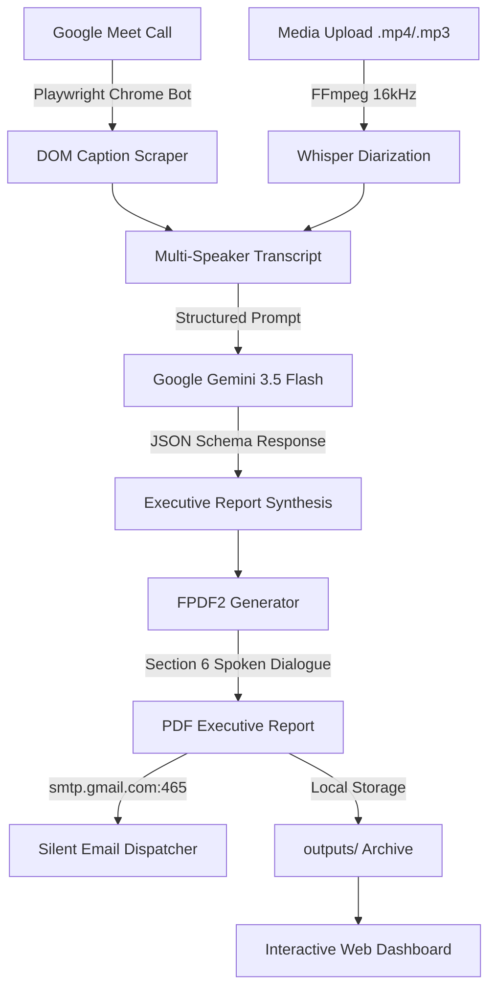

# 🏗️ MeetIQ System Architecture

MeetIQ is an autonomous AI meeting intelligence platform designed for zero-friction note-taking, transcription, and executive report synthesis.

---

## 🔄 High-Level Pipeline Architecture

---

## 🧩 Core Submodules

### 1. `app/` (Web Dashboard & API Entrypoint)
- **`main.py`**: FastAPI asynchronous web application handling bot commands, background job polling, file uploads, archive browsing, and email resending.
- **`index.html`**: Cyber-glassmorphic frontend with simulated audio visualizer, real-time closed captions stream, task tracker, and report preview modal.
- **`requirements.txt`**: Complete Python package manifest.

### 2. `core/` (Intelligence Engines)
- **`audio.py`**: Audio extraction and OpenAI Whisper diarization singleton with repetition hallucination suppression.
- **`bot.py`**: Headless Playwright automation using the native Google Chrome channel (`channel="chrome"`), automatically muting microphone/camera and streaming closed captions.
- **`gemini.py`**: Gemini 3.5 Flash integration with multilingual synthesis and strict JSON schema output.
- **`mailer.py`**: Silent Gmail SMTP email dispatcher using SSL port 465.
- **`pdf_generator.py`**: Multi-section executive PDF builder with metadata tables, action item priority badges, decisions, and Section 6 verbatim dialogue.
- **`config.py`**: Pydantic-settings management loading `.env` configuration.

### 3. `prompts/` (AI Prompt Schemas)
- System instructions, output JSON schemas, and translation definitions for meeting intelligence synthesis.

### 4. `outputs/` (Reports Directory)
- Permanent local archive for generated executive PDF documents and JSON metadata.
